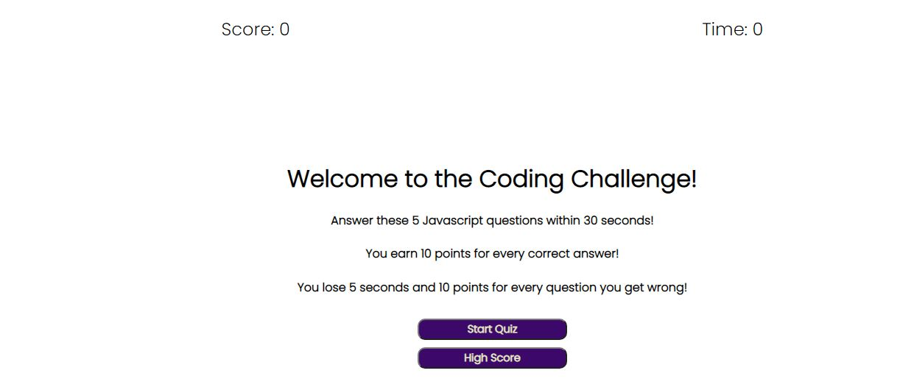
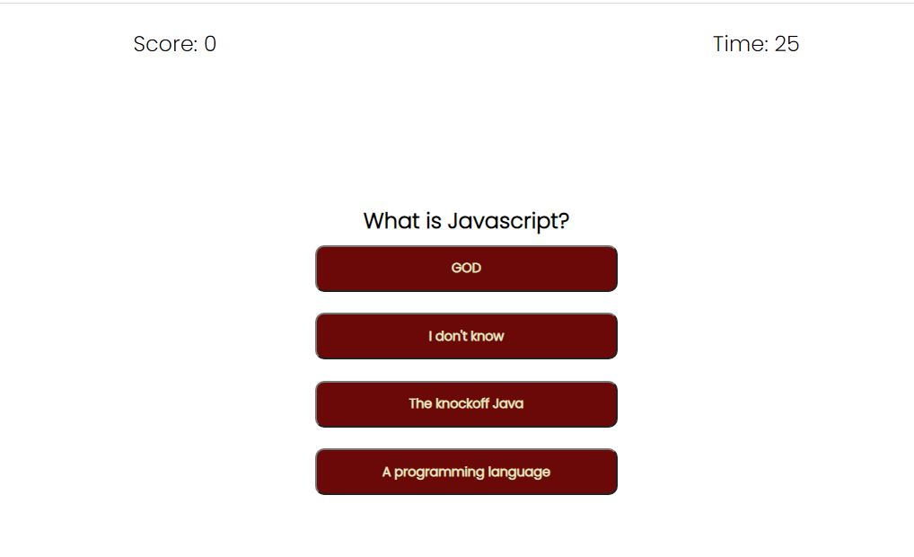
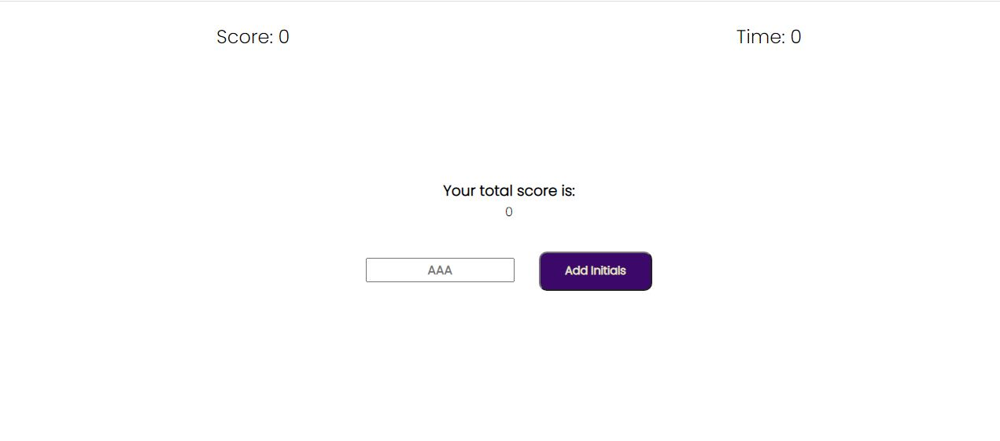
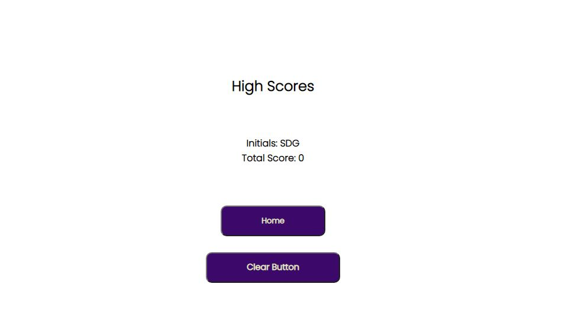

Link to website: https://asharif123.github.io/code-questionnaire/

Coding Quiz gives players the opportunity to test their Javascript fundamentals.

Players have 30 seconds to answer 5 Javascript questions in 30 seconds and for every correct answer, player earns 10 points.

For every wrong answer, player loses 5 seconds from the timer and 10 points are deducted so it's possible for a player to have a negative score.

If the player answers all 5 questions or fails to finish before timer is up, player will be redirected to a webpage containing player's score.

The program was created using HTML/CSS for the frontend and all the backend logic was made possible using Javascript.

Here are screenshots for the website:

This is the welcome screen where the player can either start the quiz or be redirected to High score page containing the most recent score.

Once "Start Quiz" button is clicked, the player will be redirected to the first question with 4 choices as shown below. 

Correct Answers will result in score increasing by 10 points and incorrect will decrease by 10 and timer will decrease by 5 seconds.

As soon as player clicks on a button, player will automatically be redirected to the next question. There are 5 questions in total.

If the time expires or player answers all 5 questions, player will be redirected to this page below where player can see their total score and enter initials. Clicking on "Add Initials" will redirect player to high scores page where they will see their score next to their initials.

After Clicking on "Add Initials", player will be redirected to the high scores page below containing their initials and high score. Clicking on "Home" button will redirect player to the main website page and clicking on "Clear Button" will remove the initials and score on the high score page.

